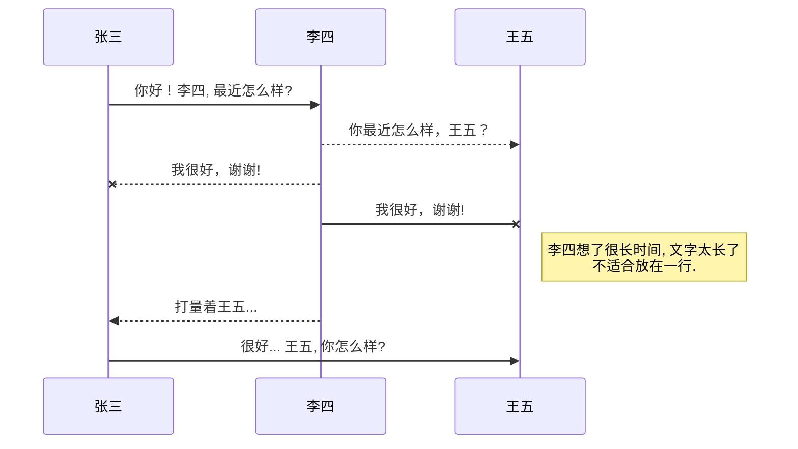

# learningJavaScript
some demo - just for learning JavaScript

```mermaid
sequenceDiagram
张三 ->> 李四: 你好！李四, 最近怎么样?
李四-->>王五: 你最近怎么样，王五？
李四--x 张三: 我很好，谢谢!
李四-x 王五: 我很好，谢谢!
Note right of 王五: 李四想了很长时间, 文字太长了<br/>不适合放在一行.

李四-->>张三: 打量着王五...
张三->>王五: 很好... 王五, 你怎么样?
```
